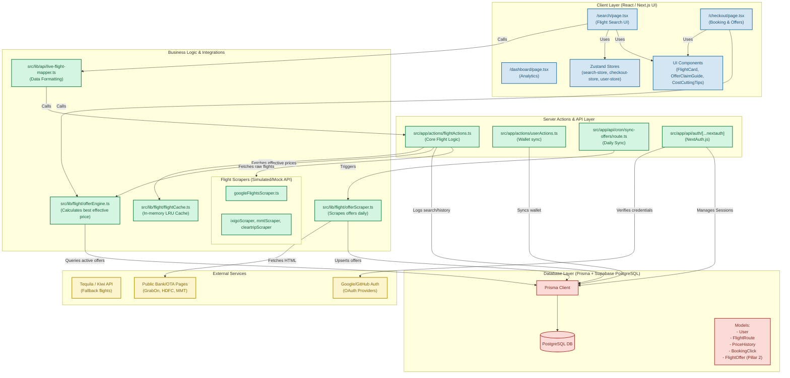

# AirBook Architecture Graph

This document provides a comprehensive, graph-based overview of the AirBook codebase. You can use this to quickly onboard any AI onto the project.

## System Architecture Overview

## Core Modules & Responsibilities

### 1. **Flight Search & Streaming (Phase 5 WIP)**
- `src/app/search/page.tsx`: The main UI for searching flights. Displays skeleton loaders while calling the server actions.
- `src/lib/api/live-flight-mapper.ts`: Normalizes raw enriched flight data into the `FlightResult` format expected by the frontend.
- `src/app/actions/flightActions.ts`: Handles the heavy lifting. Dispatches parallel requests to scrapers (`googleFlightsScraper`, `ixigoScraper`, `mmtScraper`, `cleartripScraper`), deduplicates results, applies smart pricing via `offerEngine`, logs history via Prisma, and caches the final results.

### 2. **Dynamic Offer Engine (Pillar 2)**
- `prisma/schema.prisma`: Contains the `FlightOffer` model (DB-backed, expiry-aware).
- `src/lib/flight/offerEngine.ts`: Fetches applicable offers from DB (cached 5 mins), filters by the user's saved cards, calculates the best effective price, and returns offer metadata.
- `src/lib/flight/offerScraper.ts`: Uses `fetch` to scrape public offer pages (GrabOn, Bank pages) and parses HTML to find discount details.
- `src/app/api/cron/sync-offers/route.ts`: Vercel Cron job that runs daily to trigger `offerScraper.ts` and sync the DB.

### 3. **Checkout & Savings Guidance (Pillar 1)**
- `src/app/checkout/page.tsx`: Presents the selected flight and the calculated discounts.
- `src/components/ui/OfferClaimGuide.tsx`: Contextual step-by-step guide for claiming the applied offer (e.g., how to use an HDFC credit card code).

### 4. **Analytics & Dashboard**
- `src/app/actions/flightActions.ts`: Contains `logSearchAction` and `logBookingClick` to inflate search counts and record actual money saved.
- `src/components/dashboard/PriceTrendChart.tsx`: Pulls `PriceHistory` from Prisma to display 30-day price trends.

## Pending Implementation Details (Where the previous AI stopped)

**Pillar 3: Performance Optimization Layer 1 (Streaming Results)**
- Currently, `getAndTrackFlights` in `flightActions.ts` waits for *all* scrapers to finish via `Promise.allSettled`.
- The Next.js frontend waits for this combined payload.
- **Goal**: Split this into two phases:
  1. `getGoogleFlightsAction`: Fetch Google Flights (fast), return immediately to the frontend.
  2. `getOTAFlightsAction`: Fetch OTA Flights (Ixigo, MMT, Cleartrip), append seamlessly to the search results state.
- **Frontend changes**: Update `search/page.tsx` to handle a two-phase loading state (displaying Google results while showing a "Loading more sources..." indicator for OTAs).
