# TheWingsScan Architecture Graph

This is the quick graph view of the current production architecture. The detailed source of truth remains `ARCHITECTURE.md`.

```mermaid
graph TD
    classDef client fill:#e8f2ff,stroke:#2563eb,color:#172554
    classDef server fill:#ecfdf3,stroke:#16a34a,color:#052e16
    classDef data fill:#fff7ed,stroke:#ea580c,color:#431407
    classDef db fill:#fef2f2,stroke:#dc2626,color:#450a0a

    subgraph Client["Next.js App Router UI"]
        Home["/ page\nTheWingsScan search hero"]:::client
        Search["/search\nFlight results, filters, wallet"]:::client
        Checkout["/checkout\nOffer breakdown + booking handoff"]:::client
        Alerts["/alerts\nAuthenticated fare alerts"]:::client
        Status["/status\nRoute tools + source status"]:::client
        Stores["Zustand stores\nsearch, checkout, user"]:::client
    end

    subgraph Actions["Server Actions + API Routes"]
        FlightActions["flightActions.ts\nsearch, tracking, booking links"]:::server
        AlertActions["alertActions.ts\nPrisma-backed alerts"]:::server
        CompareActions["compare/deals/intelligence actions\nTravelpayouts-derived insights"]:::server
        AirportsRoute["/api/airports\nTravelpayouts first, local fallback"]:::server
        CalendarRoute["/api/calendar\nFare calendar + holiday overlay"]:::server
        CronRoute["/api/cron/track\nPrice history + alert emails"]:::server
    end

    subgraph Integration["Travelpayouts Integration"]
        TPClient["travelpayoutsClient.ts\nData API, real-time search, click links"]:::data
        TPTypes["travelpayoutsTypes.ts\nZod validation + normalized fares"]:::data
        TPCache["travelpayoutsCache.ts\nshort-lived in-memory cache"]:::data
        Mapper["live-flight-mapper.ts\nfrontend FlightResult mapping"]:::data
    end

    subgraph Business["Business Logic"]
        OfferEngine["offerEngine.ts\nbest effective price"]:::server
        SplitTicket["splitTicket.ts\nalternative itineraries"]:::server
        Validators["validators.ts\nrequest validation"]:::server
    end

    subgraph Database["Prisma + Supabase PostgreSQL"]
        Prisma["Prisma Client"]:::db
        DB[("PostgreSQL")]:::db
        Models["User, Account, SearchHistory,\nPriceHistory, BookingClick,\nPriceAlert, FlightOffer"]:::db
    end

    subgraph External["External Services"]
        Travelpayouts["Travelpayouts / Aviasales APIs"]:::data
        Resend["Resend email"]:::data
        OAuth["Google OAuth"]:::data
    end

    Home --> Stores
    Search --> Stores
    Search --> Mapper
    Checkout --> FlightActions
    Alerts --> AlertActions
    Status --> FlightActions

    Mapper --> FlightActions
    FlightActions --> TPClient
    CompareActions --> TPClient
    AirportsRoute --> TPClient
    CalendarRoute --> TPClient
    CronRoute --> FlightActions

    TPClient --> TPTypes
    TPClient --> TPCache
    TPClient --> Travelpayouts

    FlightActions --> OfferEngine
    FlightActions --> SplitTicket
    FlightActions --> Prisma
    AlertActions --> Prisma
    CronRoute --> Resend
    Prisma --> DB
    Prisma --> Models
    OAuth --> Prisma
```

## Active Flow

1. The UI calls server actions instead of exposing API tokens in the browser.
2. `travelpayoutsClient.ts` retrieves airports, fare calendars, latest prices, optional real-time results, and booking click links.
3. `live-flight-mapper.ts` normalizes enriched server results into frontend `FlightResult` objects.
4. `offerEngine.ts` applies saved wallet/card context to compute effective prices.
5. Prisma stores user state, searches, booking clicks, price history, and fare alerts.

## Production Notes

- Travelpayouts secrets stay server-side.
- Aviasales real-time search is opt-in through `TRAVELPAYOUTS_ENABLE_REALTIME_SEARCH=true`.
- Booking click links are generated only when a real-time result includes `searchId` and `bookingToken`.
- The app no longer depends on browser scraping for flight search.
