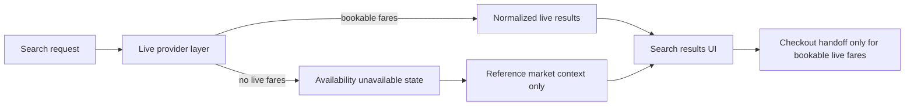

# AirBook production booking audit and implementation blueprint

## Scope

This audit covers the customer-facing flight discovery and booking flow, with emphasis on live search quality, premium UX, responsiveness, motion, accessibility, and removal of static or simulated route or flight data from the traveler UI.

Primary files reviewed:

- `src/app/page.tsx`
- `src/app/search/page.tsx`
- `src/app/checkout/page.tsx`
- `src/app/status/page.tsx`
- `src/app/actions/flightActions.ts`
- `src/lib/api/flight-data-provider.ts`
- `src/lib/api/live-flight-mapper.ts`
- `src/lib/api/amadeus-provider.ts`
- `src/lib/api/amadeusClient.ts`
- `src/lib/api/travelpayoutsClient.ts`
- `src/lib/api/simulated-provider.ts`
- `src/components/layout/Navbar.tsx`
- `src/components/layout/Footer.tsx`
- `src/components/ui/ParticleBackground.tsx`
- `src/components/ui/AirlineLogo.tsx`
- `src/components/ui/DateHinter.tsx`
- `src/components/ui/AlternativeItineraries.tsx`
- `src/styles/tokens.css`
- `src/app/globals.css`

## Executive summary

The current search experience is not production-safe because the live results pipeline mixes live, cached, and simulated offers without exposing trust status to the UI. In practice, the system is biased toward returning synthetic data whenever live providers are weak or unavailable.

The most important issues are:

1. The main client-facing search pipeline can return simulated offers by default.
2. The fallback order is incorrect, so cached and simulated data can dominate before live sources are fully exhausted.
3. The mapper used by the search page drops booking metadata, so checkout cannot complete a live handoff and falls back to a generic booking page.
4. Several pages still expose static route data, internal provider terminology, or internal model metadata.
5. The premium visual system is promising, but it needs stronger information hierarchy, tighter state design, and better motion and accessibility discipline.

## Current-state audit

### 1. Static or simulated data currently exposed or likely to surface in UI

#### A. Simulated fares are part of the main search path

- `src/lib/api/simulated-provider.ts` is always available and generates realistic but synthetic offers, including prices, seats remaining, and schedules.
- `src/lib/api/flight-data-provider.ts` includes the simulated provider in the default provider list.
- `src/lib/api/flight-data-provider.ts` queries providers in parallel, which means synthetic data can arrive alongside live data and survive deduplication.
- `src/lib/api/live-flight-mapper.ts` maps simulated data to `master_api`, obscuring provenance.

Impact:

- Users can see synthetic fares that look real.
- Live search failures are masked instead of communicated honestly.
- Checkout trust is weakened because users cannot tell whether a fare is bookable.

#### B. Hardcoded routes are visible on the home page

- `src/app/page.tsx` contains a hardcoded `QUICK_ROUTES` array.
- `src/app/page.tsx` renders those routes as `Popular routes` chips.

Impact:

- Violates the no static hardcoded route data requirement.
- Makes the experience feel editorial rather than live.

#### C. Trending route logic is effectively placeholder data

- `src/lib/api/travelpayoutsClient.ts` builds trending routes by slicing cheapest cached routes.
- `drop_pct` is hardcoded to `0`, while `week_avg` and `current_price` are derived from the same cached value.
- `src/app/page.tsx` presents these as `Trending price drops`.

Impact:

- The UI implies market movement that is not truly calculated.
- This is pseudo-dynamic content rather than trustworthy trend analysis.

#### D. Internal provider and model concepts surface in traveler-facing UI

- `src/app/page.tsx` uses copy such as `cached fare calendars`, `token-safe architecture`, and `provider-level comparisons`.
- `src/app/search/page.tsx` uses empty-state copy referring to `The provider`.
- `src/app/intelligence/page.tsx` exposes `model_version` and `training_samples`.
- `src/app/compare/page.tsx` exposes `OTA Comparison` and raw source names.
- `src/app/aggregator/page.tsx` exposes providers and booking source labels directly.

Impact:

- Conflicts with the requirement to avoid backend or provider names in traveler-facing copy.
- Makes the UX feel like an internal demo instead of a premium booking product.

#### E. Other hardcoded or inferred UI data

- `src/app/status/page.tsx` links into intelligence using a hardcoded destination of `BOM`.
- `src/components/ui/OfferClaimGuide.tsx` contains hardcoded partner-flow guidance and OTA assumptions.
- `src/components/ui/CostCuttingTips.tsx` contains hardcoded generic OTA advice.

### 2. Why live search is failing or degrading into non-live results

#### A. The main search page does not use the stronger server action pipeline

- `src/app/search/page.tsx` calls `fetchFlights` from `src/lib/api/live-flight-mapper.ts`.
- `src/app/actions/flightActions.ts` contains a separate `searchFlightsAction` flow that merges Amadeus and Travelpayouts more directly.

Impact:

- There are two search pipelines with different behaviors.
- The user-facing page is not necessarily using the best or most complete one.

#### B. The orchestrator fallback order is wrong

- `src/lib/api/flight-data-provider.ts` sets providers to Amadeus plus simulated.
- Travelpayouts is only used as a last resort if `allOffers.length === 0`.
- Because the simulated provider almost always returns offers, Travelpayouts can be skipped entirely.

Impact:

- A synthetic route can prevent the system from ever reaching a real or near-real fallback.
- This is a core reason live search looks broken while still returning plausible results.

#### C. Real-time Travel data is optional and silently degrades to calendar data

- `src/lib/api/travelpayoutsClient.ts` only uses real-time search when `TRAVELPAYOUTS_ENABLE_REALTIME_SEARCH` is `true`.
- It also requires marker, host, and a public user IP.
- Missing config causes a silent fall back to cached calendar rows.

Impact:

- The app can appear operational while actually returning non-bookable cached fares.
- There is no strong traveler-facing distinction between live results and historical fare references.

#### D. Booking metadata is dropped before checkout

- `src/lib/api/travelpayoutsClient.ts` can return `bookingToken`, `searchId`, and `gateId`.
- `src/lib/api/live-flight-mapper.ts` maps all results into `FlightResult` but forces `bookingToken`, `searchId`, and `gateId` to `null`.
- `src/app/checkout/page.tsx` therefore falls back to a generic Cleartrip URL.

Impact:

- Even if live search succeeds, checkout cannot do a trusted session-specific booking handoff.
- This is a direct explanation for live search not feeling useful.

#### E. A likely blocking bug exists in the live mapper

- `src/lib/api/live-flight-mapper.ts` begins with `appimport` rather than `import`.

Impact:

- If this is the current file state in the branch, search can fail at compile or import time.
- This must be treated as a P0 issue.

#### F. Auxiliary data slows the first meaningful result paint

- `src/app/search/page.tsx` waits for both fares and intelligence requests before ending the main loading state.

Impact:

- Users wait longer before seeing primary results.
- Slow secondary intelligence calls can make live search feel sluggish or stalled.

### 3. Highest-value UI and UX upgrades for a premium production booking experience

#### Home

- Remove editorial hardcoded route chips unless backed by real route demand or user history.
- Replace internal product language with traveler-facing value language.
- Strengthen search-first hierarchy so the search panel is the unmistakable hero action.
- Introduce dynamic recent searches, saved routes, or personalized route suggestions only when real data exists.

#### Search

- Introduce a trust banner that clearly states one of:
  - Live fares available
  - Limited live availability
  - Live booking temporarily unavailable, showing market context only
- Separate primary results from secondary intelligence modules so results paint first.
- Add an inline route-edit module in the sticky header rather than forcing a return to the home page.
- Make fare cards feel more premium with clearer hierarchy around airline, schedule, baggage, flexibility, and savings.
- Reframe advanced features such as split-ticket and hidden-city ideas as optional expert tools, not core result content.

#### Checkout

- Only allow `Continue` when a valid bookable handoff exists.
- Replace the generic partner-page fallback with a graceful unavailability state.
- Improve fare rule clarity, baggage visibility, and trust messaging.
- Make the right rail feel like a premium confirmation surface rather than a generic summary card.

#### Status and supporting surfaces

- Remove hardcoded route assumptions.
- Rework status as a reliable operational lookup, or clearly label it as limited if data is partial.
- Hide internal analytics and provider details from compare and intelligence surfaces unless they are recast as traveler-friendly market insights.

## Motion, responsive, accessibility, loading, empty, and error-state gaps

### Motion

- `src/components/ui/ParticleBackground.tsx` runs a full-screen animated canvas with no reduced-motion branch and no mobile density tuning.
- Several page transitions are tasteful, but motion is not prioritized by content importance.
- Recommendation: reserve stronger motion for hero and confirmation moments, while search and checkout should prioritize clarity and speed.

### Responsive behavior

- Search and checkout headers are dense on smaller screens.
- Filter drawer and wallet modal need stronger mobile ergonomics.
- Search page side content can overwhelm the primary list on smaller widths.

### Accessibility

- Home page airport inputs look like comboboxes but do not implement full keyboard combobox behavior.
- `ghost-input` in `src/app/globals.css` aggressively removes native input affordances.
- The filter drawer and wallet modal need better focus trapping, focus return, and keyboard close behavior.
- Search result count and async save feedback should use `aria-live` regions.

### Loading states

- Search blocks on intelligence and fares together.
- Date hints and alternative itinerary panels pop in later without dedicated skeletons or reservation of layout space.
- Checkout offer loading is acceptable, but booking-link readiness is not surfaced.

### Empty and error states

- Search empty states blame a `provider`, which is not traveler-friendly.
- There is no explicit distinction between no inventory, no live connectivity, and no data confidence.
- Checkout should have a dedicated state for `selected fare no longer bookable`.

### Design-token and style risks

- `src/components/ui/AlternativeItineraries.tsx` uses `--accent-blue`, which is not defined in `src/styles/tokens.css`.
- Similar missing blue token usage also appears outside the audited core flow.

## Graceful degradation rules

The UI must never show fake bookable inventory.

### Recommended search-state contract

For every fare payload, distinguish:

- `bookable_live`
- `reference_only_cached`
- `unavailable`

If no live bookable fares are available:

- Show nearby-date pricing context if it is genuine cached market data.
- Allow alert creation, route saving, and retry.
- Disable checkout continuation.
- Do not show random seat scarcity, refundability certainty, or synthetic baggage certainty.

### Recommended traveler messaging

Use language like:

- `Live booking is temporarily unavailable for this route`
- `Showing recent market context while we retry availability`
- `Save this route and we will notify you when live fares return`

Avoid language like:

- `Provider error`
- `Travelpayouts`
- `Amadeus`
- `model version`
- `training samples`

## Target architecture

## Priority-ordered implementation plan

### P0 — Stop fake inventory from reaching travelers

#### Affected files

- `src/lib/api/live-flight-mapper.ts`
- `src/lib/api/flight-data-provider.ts`
- `src/lib/api/simulated-provider.ts`
- `src/lib/api/travelpayoutsClient.ts`
- `src/lib/api/amadeus-provider.ts`
- `src/lib/api/amadeusClient.ts`
- `src/lib/types.ts`
- `src/app/search/page.tsx`
- `src/app/checkout/page.tsx`

#### Changes

1. Fix the mapper import bug and make the file compile cleanly.
2. Remove the simulated provider from the production traveler path, or gate it behind an explicit development-only flag.
3. Reorder fallback logic so live providers run first, cached market context runs second, and simulated results never appear to travelers.
4. Preserve booking metadata from live sources through normalization.
5. Add explicit result metadata such as availability state, bookability, freshness, and confidence.
6. Disable checkout continuation whenever a result cannot produce a real booking handoff.

### P1 — Unify the search experience around trust and speed

#### Affected files

- `src/app/search/page.tsx`
- `src/components/ui/DateHinter.tsx`
- `src/components/ui/FareDipAlert.tsx`
- `src/components/ui/AlternativeItineraries.tsx`
- `src/components/ui/CostCuttingTips.tsx`
- `src/app/actions/flightActions.ts`

#### Changes

1. Consolidate onto one search pipeline and remove split logic between server action and client mapper paths.
2. End the primary loading state as soon as fares arrive; load intelligence panels progressively.
3. Add a traveler-facing availability banner and richer retry and recovery states.
4. Convert advanced savings modules into clearly labeled optional tools, or hide them when data confidence is low.
5. Remove hardcoded advice that implies specific providers, portals, or pricing behaviors unless it is data-backed.

### P2 — Elevate home and checkout into a premium conversion path

#### Affected files

- `src/app/page.tsx`
- `src/app/checkout/page.tsx`
- `src/components/layout/Navbar.tsx`
- `src/components/layout/Footer.tsx`
- `src/components/ui/OfferClaimGuide.tsx`
- `src/lib/utils.ts`
- `src/lib/flight/offerEngine.ts`

#### Changes

1. Remove hardcoded quick routes and pseudo-trend content unless backed by real signals.
2. Rewrite home page copy to focus on traveler outcomes rather than internal architecture.
3. Move `New Search` navigation to a safe route that always has valid state.
4. Centralize convenience fee calculations so search and checkout are consistent.
5. Replace generic booking fallback URLs with a trustworthy unavailability flow.
6. Rewrite offer guidance to be more neutral and less dependent on hardcoded partner assumptions.

### P3 — Refine supporting pages and consistency across surfaces

#### Affected files

- `src/app/status/page.tsx`
- `src/app/intelligence/page.tsx`
- `src/app/compare/page.tsx`
- `src/app/aggregator/page.tsx`
- `src/components/ui/AirlineLogo.tsx`

#### Changes

1. Remove hardcoded destination assumptions and misleading cross-links in status.
2. Hide internal model and provider metadata from traveler-facing intelligence UI.
3. Recast compare and aggregator surfaces so they speak in traveler terms rather than source and provider terms.
4. Consider a local fallback for airline logos so critical result UI does not depend on external placeholder services.

### P4 — Accessibility, performance, and motion polish

#### Affected files

- `src/components/ui/ParticleBackground.tsx`
- `src/styles/tokens.css`
- `src/app/globals.css`
- `src/app/page.tsx`
- `src/app/search/page.tsx`

#### Changes

1. Add reduced-motion behavior and lower particle density on mobile and low-power contexts.
2. Restore stronger visible focus states for form controls.
3. Finish combobox keyboard support for airport search.
4. Add missing semantic tokens and remove undefined token usage.
5. Improve modal and drawer accessibility with focus management and escape handling.

## Recommended implementation order

1. Stabilize the data pipeline and remove simulated traveler-facing inventory.
2. Restore true booking handoff metadata and gate checkout on bookability.
3. Rebuild the search result state model around live, cached, and unavailable modes.
4. Clean home page and shared copy so no provider or tool language leaks into the UI.
5. Upgrade checkout trust, error recovery, and conversion flow.
6. Polish supporting pages, motion, accessibility, and responsiveness.

## Acceptance criteria

- No synthetic or random flight inventory appears in traveler-facing search results.
- No static hardcoded route or flight data is shown in the primary UI.
- Search results clearly distinguish live bookable fares from reference-only market context.
- Checkout is only possible when a real booking handoff exists.
- Traveler-facing copy does not expose provider, backend, or model terminology.
- Home, search, checkout, and status all behave cleanly across mobile and desktop.
